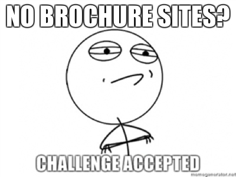
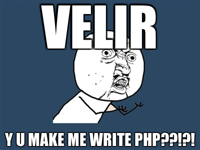

!SLIDE 

# The Problem #

### What Ruby CMS fits client needs? ###

!SLIDE 

# My Answer #

### None! #

!SLIDE center

# Expected result: #

### No boring brochure website work ###

!SLIDE center

# Actual Result: #

### DRUPAL!!!! ###

!SLIDE center

# Time to panic. #

!SLIDE 
# BrowserCMS #
## My savior from PHP ##

!SLIDE smbullets

## How does it save me? ##

* Built as a Rails Engine (in 2.3 no less)
* Comfortable for developers, designers, users
* Fills all TAM criteria
* Not Radiant or Drupal