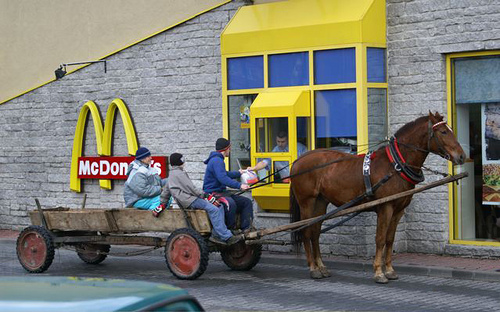

!SLIDE
# Vagrant #

!SLIDE
# Ruby Development Environments Suck #

!SLIDE center

# Dependency Hell #

!SLIDE smbullets
## Dependency Hell ##

* Ruby
* Ruby Libraries (Gems)
* External Libraries (Search, Persistence, HTTP servers)

!SLIDE center

# C Extensions #

!SLIDE center

# We can fix it #

!SLIDE smbullets

# Vagrant #

* Ruby Wrapper for Virtual Box
* Easy to Provision
* Easy to Distribute
* Relatively Transparent

!SLIDE smbullets

## On your local machine ##

* Use of your text editor of choice
* Use of your SCM tools of choice
* Forwarded port to your browser
* SSH tunnel into the virtual machine

## On the Vagrant Machine ##

* Full webstack installed / running
* Tailored to mirror production.

!SLIDE smbullets center

## Gotchas ##

* Difficult for Ruby IDE's.
* nginx is a little funny with symlinks.